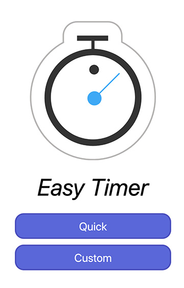
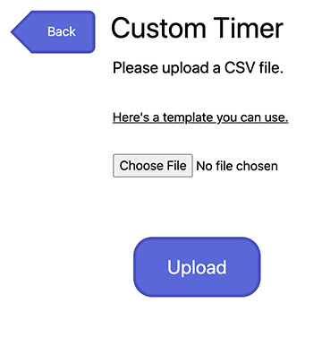
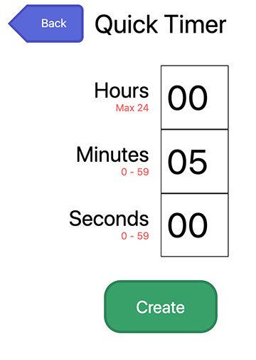
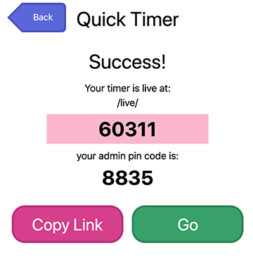
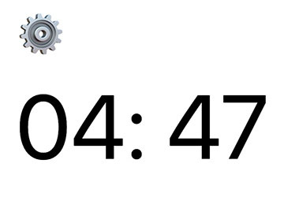
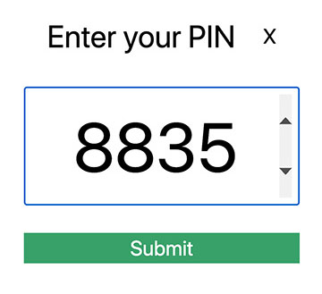
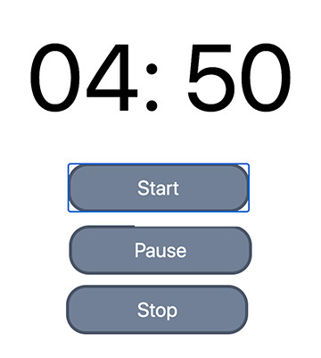

# EasyTimer

Developed in Spring 2020 with the help of my mentor, Lars Wikman

## Shareable and Synchronized

With this web application, you can create live countdown timers to share with others.

## Screenshots

## Options

- Hours, minutes, seconds (limit to 24 hours)
- A public web link to share with anyone
- Play, pause, stop, next, and previous controls (admins only)
- Share admin control via a PIN code
- **Quick**: single
- **Custom**: multiple named timers in a series

## App Notes

- The application works, but the UI is unpolished.
- Timers are live for 24 hours before deletion
- Custom, multi-phase timers currently require setup by uploading a CSV file. Future versions may support web forms.

## Feature Roadmap

- Add Custom timer web forms to supplement CSV files
- Add start/warning/ending sounds

## Stack

- Elixir Phoenix application without no database
- RESTful homepage and setup pages
- Dynamic client/server interaction via Phoenix LiveView

## Dev Roadmap

- Possibly transition web deadviews to liveviews
- Tailwind CSS

## Dev Notes

- Tailwind configured for Phoenix via [phoenix-config-for-tailwind](https://github.com/jfreeze/phoenix-config-for-tailwind)
- UI debugging via alternating nested "db{r,b,g}" debug border red, blue, and grey classes
- UI debugging is activated/deactivated manually by commenting out the "@import './dev.css'" statement in: "assets/css/app.css"

## Bugs

- Nonfunctional "Copy Link" to clipboard button in successful timer creation screen.
